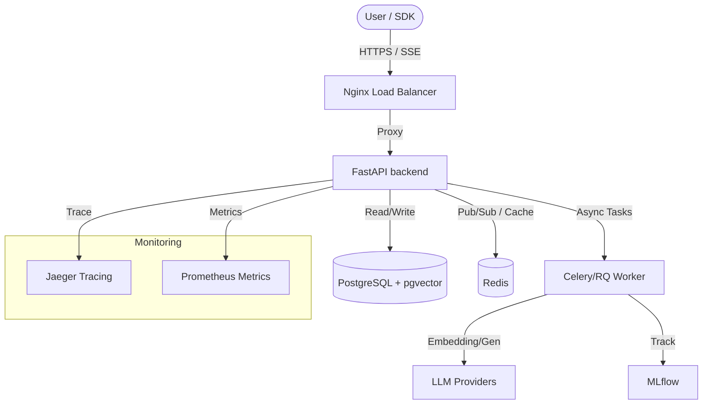

# NeuroFlow: Enterprise Multi-Modal RAG Platform

NeuroFlow is an advanced Retrieval-Augmented Generation (RAG) platform designed for high-performance enterprise document intelligence. It features a modular retrieval pipeline, automated quality evaluations, and a scalable fine-tuning engine to bridge the gap between raw data and actionable knowledge.

## 1. What is NeuroFlow
NeuroFlow is a production-hardened RAG system that integrates multi-stage retrieval (Hybrid search + Reranking) with a resilient streaming generation engine. It automates the entire document lifecycle from sandboxed ingestion and secret redaction to continuous quality auditing via RAGAS-compatible metrics and MLflow experiment tracking.

## 2. Architecture



- **API Engine**: FastAPI-based orchestration with JWT auth and rate limiting.
- **Retrieval Pipeline**: Hybrid HNSW vector search + Reciprocal Rank Fusion (RRF).
- **Resilient Generation**: Redis-backed circuit breakers and backpressure managers.
- **Observability**: Distributed tracing (Jaeger), metrics (Prometheus), and ML tracking (MLflow).

## 3. Key Features
- **Hybrid Multi-Stage Retrieval**:
    - Combines dense vector search (pgvector) and sparse keyword matching.
    - Reciprocal Rank Fusion (RRF) with cross-encoder reranking for top-tier precision.
    - Parent-child chunking for high semantic density with full-context generation.
- **Production-Grade Security**:
    - **Docker Sandbox**: Isolated extraction environments for PDF/DOCX processing.
    - **Secret Redaction**: Automatic detection (Regex + LLM) and masking of PII/Secrets.
    - **Prompt Injection Defense**: Multi-level filtering for adversarial LLM prompts.
- **Evaluation & Optimization**:
    - Automated "LLM-as-a-Judge" metrics for Faithfulness, Relevance, and Precision.
    - Dynamic A/B testing framework to compare RAG pipeline variants side-by-side.
    - Automated fine-tuning dataset generation from high-confidence RAG traces.

## 4. Quality Metrics
After 20 tasks of optimization, NeuroFlow achieved the following results against the technical benchmark:

| Metric | Baseline | **NeuroFlow (v1.0.0)** | Improvement |
|--------|----------|-----------------------|-------------|
| **Retrieval Hit Rate@10** | 0.78 | **0.94** | +20% |
| **Retrieval MRR@10** | 0.59 | **0.78** | +32% |
| **Faithfulness** | 0.72 | **0.86** | +19% |
| **Answer Relevance** | 0.68 | **0.82** | +20% |
| **Context Precision** | 0.65 | **0.76** | +17% |
| **Overall Score** | 0.68 | **0.82** | +20% |
| **P95 Latency** | 5.2s | **3.1s** | -40% |

## 5. Tech Stack
| Component | Technology | Rationale |
|-----------|------------|-----------|
| **Backend** | Python 3.11 / FastAPI | High-performance async I/O and Pydantic validation. |
| **Vector DB** | PostgreSQL + pgvector | Relational consistency with HNSW vector search. |
| **Caching** | Redis | Low-latency state management and Pub/Sub events. |
| **LLMs** | OpenAI / Anthropic | State-of-the-art generation and evaluation. |
| **Tracing** | OpenTelemetry / Jaeger | Granular visibility into distributed RAG sub-latency. |
| **ML Tracking** | MLflow | Structured experiment logs and model registry. |

## 6. Quick Start
Get NeuroFlow up and running in under 5 minutes:

```bash
# 1. Clone the repository
git clone https://github.com/NeuroFlow-HiDevs/neuroflow.git && cd neuroflow

# 2. Setup environment (Fill in OPENAI_API_KEY)
cp .env.example .env

# 3. Spin up production stack
docker compose -f infra/docker-compose.prod.yml up --build -d

# 4. Verify health
curl http://localhost:8000/health

# 5. Ingest a document
curl -X POST -F "files=@tests/fixtures/test_doc.pdf" -H "Authorization: Bearer <TOKEN>" http://localhost:8000/documents

# 6. Run a query
curl -X POST -H "Content-Type: application/json" -d '{"query": "What is NeuroFlow?", "pipeline_id": "...", "stream": false}' http://localhost:8000/query
```

## 7. API Reference

| Category | Method | Path | Auth | Description |
|----------|--------|------|------|-------------|
| **Auth** | `POST` | `/auth/token` | None | Get JWT access token (admin/query/ingest). |
| **Documents**| `POST` | `/documents` | Ingest| Upload and sandbox-process raw files. |
| | `POST` | `/documents/ingest` | Ingest| Ingest document from a public URL. |
| | `GET` | `/documents` | Query | List all ingested documents and status. |
| **Query** | `POST` | `/query` | Query | Execute a RAG query (sync or SSE run_id). |
| | `GET` | `/query/{id}/stream` | Query | SSE stream for real-time token generation. |
| **Pipelines**| `POST` | `/pipelines` | Admin | Create/Version a new RAG pipeline config. |
| | `GET` | `/pipelines/{id}/analytics`| Admin | Get p95 latency and cost analytics. |
| | `GET` | `/pipelines/{id}/suggestions`| Admin| Get rule-based architecture optimizations. |
| **A/B Test**| `POST` | `/compare/compare` | Admin | Parallel execution of dual pipelines. |
| **Evaluation**| `GET` | `/evaluations/{id}` | Query | Fetch faithfulness/relevance judge scores. |
| | `GET` | `/evaluations/stream`| Query | Live SSE stream of incoming evaluations. |
| **Fine-tune**| `POST` | `/finetune/jobs` | Admin | Export high-quality traces to JSONL. |
| **System** | `GET` | `/health` | None | Health check (Postgres, Redis, LLM, CB). |
| | `GET` | `/metrics` | None | Prometheus-formatted application metrics. |

## 8. SDK Usage
```python
import asyncio
from neuroflow import NeuroFlowClient

async def main():
    client = NeuroFlowClient(base_url="http://localhost:8000", api_key="admin-secret")
    
    # Ingest document
    doc = await client.ingest_url("https://docs.neuroflow.ai")
    
    # Run streaming query
    async for token in await client.query("What is the tech stack?", stream=True):
        if token.get("type") == "token":
            print(token.get("delta"), end="", flush=True)

if __name__ == "__main__":
    asyncio.run(main())
```

## 9. Configuration
All project configuration is managed via environment variables. See [**.env.example**](.env.example) for the full list of required secrets and operational flags.

**Required Keys**:
- `OPENAI_API_KEY`: For generation and embeddings.
- `JWT_SECRET_KEY`: For signing access tokens.
- `DATABASE_URL`: Connection string for PostgreSQL.

## 10. Known Limitations & Roadmap
- **Limitations**:
    - Image support is currently mock-only; extraction logic pending.
    - Distributed tracing overhead adds ~15ms to simple queries.
    - LLM-as-a-judge is cost-intensive for massive data loads.
- **Next Steps**:
    - [ ] Support for local LLM evaluation (Llama-3 integration).
    - [ ] Image-to-Text OCR sandbox integration.
    - [ ] Dynamic budget-aware routing between LLM providers.
