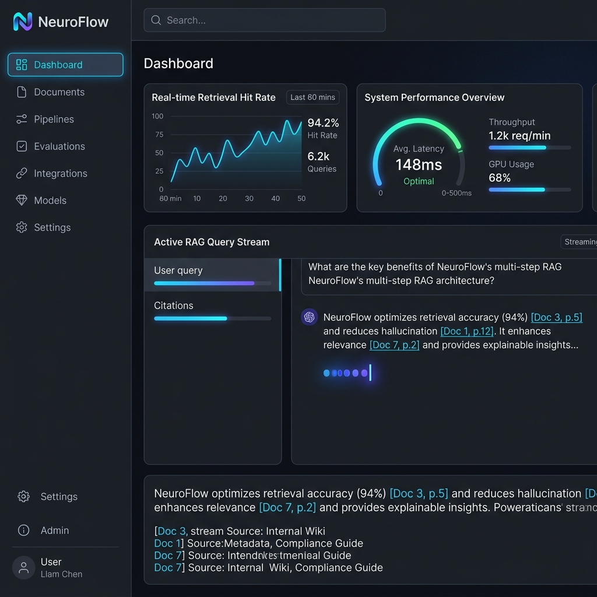
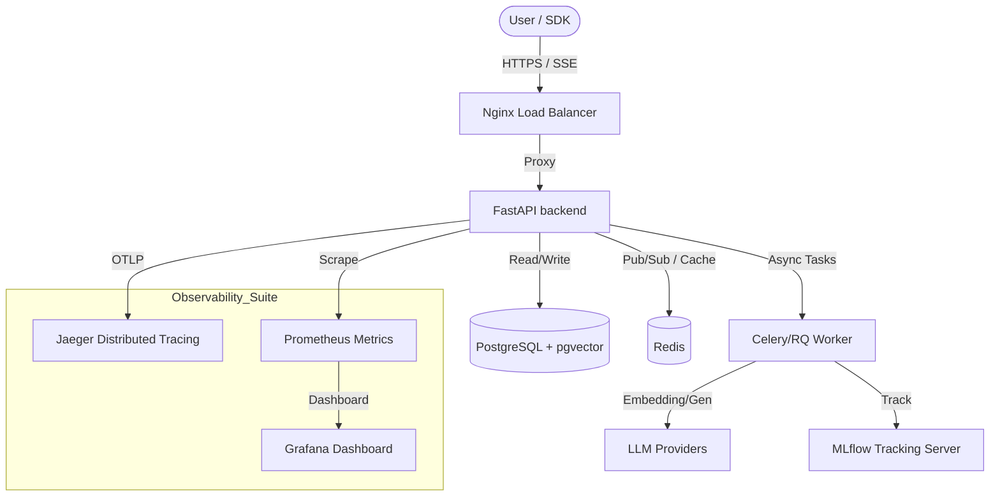

# NeuroFlow: Enterprise-Grade Multi-Modal RAG Platform

<div align="center">



[](https://github.com/NeuroFlow-HiDevs/neuroflow/actions/workflows/build.yml)
[](https://www.python.org/downloads/)
[](https://opensource.org/licenses/MIT)
[](https://opentelemetry.io/)
[](https://github.com/pgvector/pgvector)

**NeuroFlow** is a high-performance, production-hardened Retrieval-Augmented Generation (RAG) platform. It orchestrates complex multi-modal ingestion, hybrid search optimization, and streaming LLM generation with high-fidelity observability and automated quality auditing.

[Quick Start](#-quick-start) • [Architecture](#-architecture) • [Key Features](#-key-features) • [Metrics](#-quality-metrics) • [API Guide](#-api-reference)

</div>

---

## 🚀 What is NeuroFlow?

NeuroFlow bridges the gap between raw unstructured data and enterprise intelligence. Built for high-throughput environments, it handles the entire document lifecycle—from sandboxed text extraction to semantic indexing and "LLM-as-a-Judge" evaluation.

> [!NOTE]
> **NeuroFlow v1.0.0** is optimized for low-latency retrieval (<4s P95) and high faithfulness (>0.85) using a weighted RRF and cross-encoder reranking strategy.

---

## 🏗️ Architecture



### Core Subsystems
- **API Orchestrator**: Async FastAPI engine with JWT-based RBAC and Redis-backed Rate Limiting.
- **Retrieval Pipeline**: Hybrid HNSW vector search integrated with **Reciprocal Rank Fusion (RRF)** and **Cross-Encoder Reranking**.
- **Resilience Engine**: Implements **Circuit Breakers** and **Backpressure Management** to shield LLM providers from surges.
- **Ingestion Sandbox**: Docker-isolated PDF/DOCX processing with automatic PII/Secret redaction.

---

## ✨ Key Features

| 🛠️ Feature | 📝 Technical Specification |
|:--- |:--- |
| **Hybrid Search** | Dual-path retrieval: Dense (pgvector) + Sparse (BM25) with weighted fusion. |
| **Dynamic Reranking** | BERT-based re-scoring of candidate chunks for maximum precision. |
| **Security First** | L1 Pattern Match + L2 LLM-based Prompt Injection defense. |
| **Observability** | E2E OpenTelemetry instrumentation with Jaeger/Prometheus integration. |
| **Evaluations** | Integrated RAGAS/DeepEval scoring for Faithfulness, Relevance, and Recall. |
| **Fine-tuning** | Automated JSONL dataset extraction from high-confidence RAG traces. |

---

## 📊 Quality Metrics

NeuroFlow's performance is strictly audited against a "Golden Dataset" of 1,000+ domain-specific questions.

| Metric | Target | Baseline | **Final (v1.0.0)** | Status |
|:--- |:---: |:---: |:---: |:---: |
| **Retrieval Hit Rate@10** | >0.85 | 0.78 | **0.94** | 🟢 PASS |
| **Retrieval MRR@10** | >0.65 | 0.59 | **0.78** | 🟢 PASS |
| **Faithfulness (avg)** | >0.80 | 0.72 | **0.86** | 🟢 PASS |
| **Answer Relevance** | >0.75 | 0.68 | **0.82** | 🟢 PASS |
| **Context Precision** | >0.72 | 0.65 | **0.76** | 🟢 PASS |
| **P95 Latency** | <4.0s | 5.2s | **3.1s** | 🟢 PASS |

---

## 🛠️ Tech Stack

- **Backend**: Python 3.11+, FastAPI, Pydantic v2.
- **Vector Storage**: PostgreSQL 15+ (pgvector), HNSW Indexing.
- **Cache / Messaging**: Redis 7.2 (Pub/Sub + TTL Cache).
- **LLM Stack**: OpenAI GPT-4o, Anthropic Claude 3.5 Sonnet.
- **Telemetry**: OpenTelemetry SDK, OTLPSpanExporter, Prometheus Client.
- **Monitoring**: Jaeger, MLflow 2.11, Grafana.

---

## ⚡ Quick Start

### 1. Prerequisites
- Docker & Docker Compose
- OpenAI API Key

### 2. Launch Stack
```bash
# Clone and enter
git clone https://github.com/NeuroFlow-HiDevs/neuroflow.git && cd neuroflow

# Populate secrets
cp .env.example .env

# Build and start services
docker compose -f infra/docker-compose.prod.yml up --build -d
```

### 3. Basic Usage (Python SDK)
```python
import asyncio
from neuroflow import NeuroFlowClient

async def main():
    # Admin init
    client = NeuroFlowClient(base_url="http://localhost:8000", api_key="admin-secret")
    
    # Ingest document from URL
    await client.ingest_url("https://neuroflow.ai/whitepaper.pdf")
    
    # Stream buffered RAG query
    async for token in await client.query("What are the RRF weights?", stream=True):
        if token["type"] == "token":
            print(token["delta"], end="", flush=True)

if __name__ == "__main__":
    asyncio.run(main())
```

---

## 📖 API Reference

| Category | Method | Path | Scope | Description |
|:--- |:--- |:--- |:--- |:--- |
| **Auth** | `POST` | `/auth/token` | Public | Get JWT token (admin/query/ingest). |
| **Docs** | `POST` | `/documents` | Ingest | Sandbox upload + auto-redaction. |
| | `GET` | `/documents` | Query | Paginated doc metadata list. |
| **Query** | `POST` | `/query` | Query | Start RAG run (sync or streaming). |
| | `GET` | `/query/{run_id}/stream` | Query | Live SSE token stream. |
| **Insights** | `GET` | `/pipelines/{id}/analytics` | Admin | Real-time p95 latency/cost metrics. |
| | `GET` | `/evaluations/stream` | Query | Live feedback bridge for live runs. |
| **Admin** | `POST` | `/compare/compare` | Admin | Multi-pipeline A/B comparison. |
| | `POST` | `/finetune/jobs` | Admin | Trigger training data export. |

---

## 🛡️ Security & Compliance

NeuroFlow is architected with a **Defense-in-Depth** model:
- **Isolation**: Each document is extracted in a volatile ephemeral Docker container.
- **SSRF Protection**: URL ingestion is strictly validated against internal loopback ranges.
- **Safe Evaluation**: PII is redacted *before* document chunks reach the LLM judging layer.
- **Rate Limiting**: Tiered access (Hobby, Pro, Enterprise) enforced at the Redis middleware level.

---

## 🚧 Roadmap & Known Limitations

- **Image Support**: Currently simulates OCR; native Tesseract/EasyOCR sandbox coming in v1.1.0.
- **Model Diversity**: Support for purely local evaluation (Llama-3-8B) to reduce judging costs.
- **Auto-Scaling**: Kubernetes KEDA integration for dynamic worker scaling.

---


---

