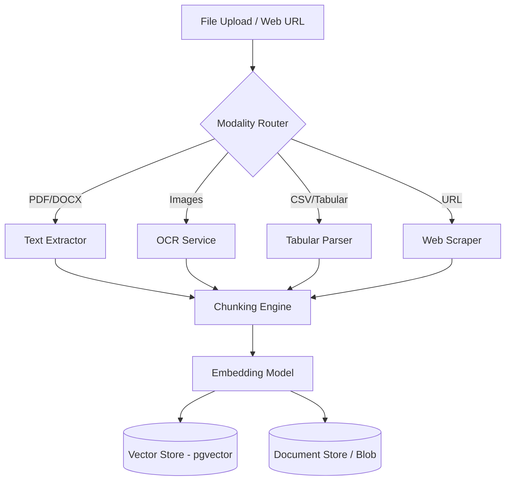
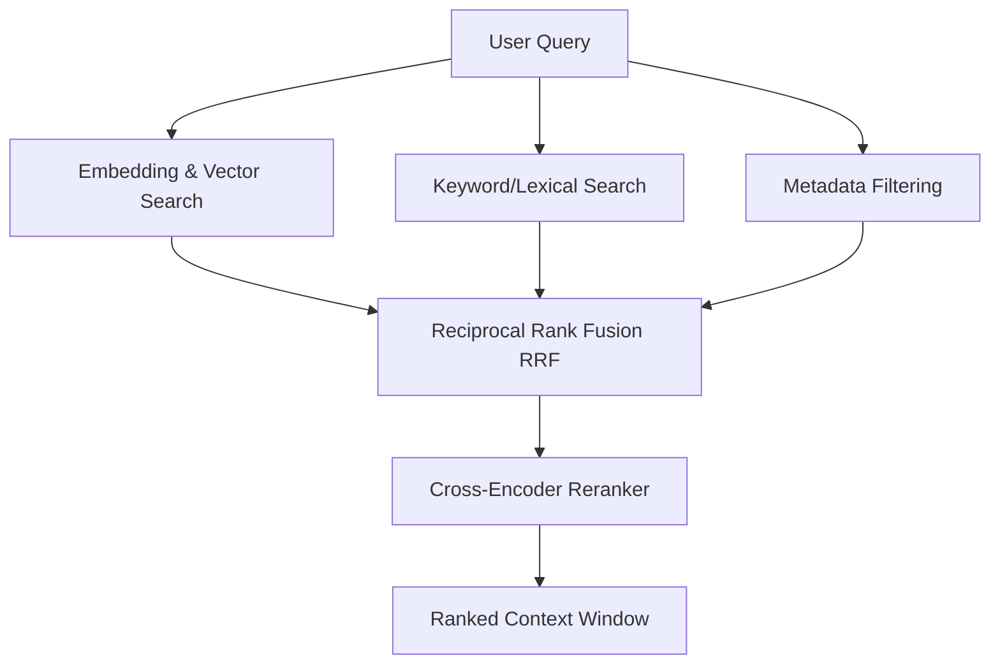
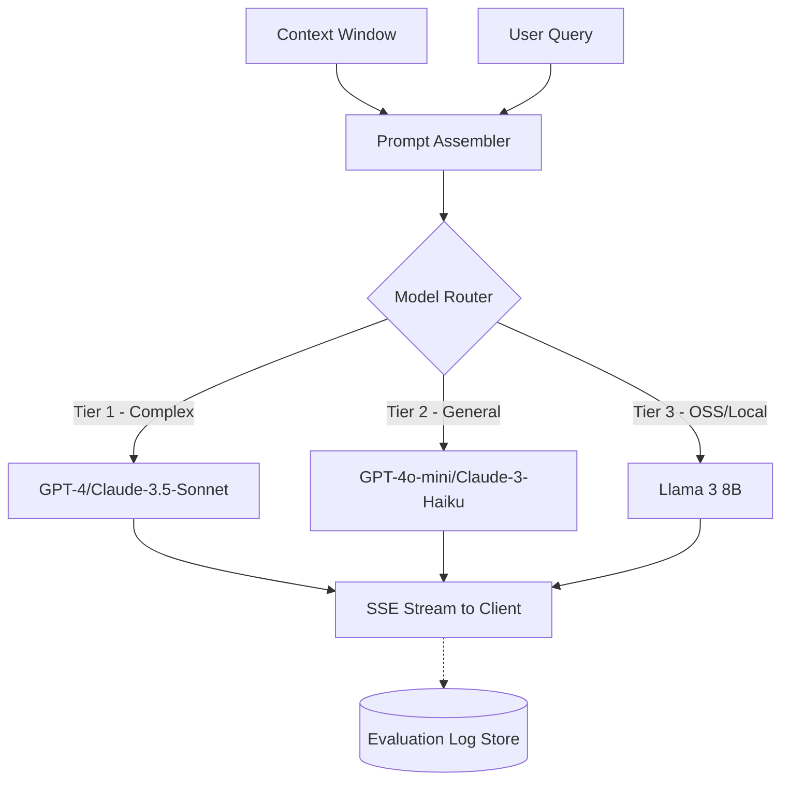
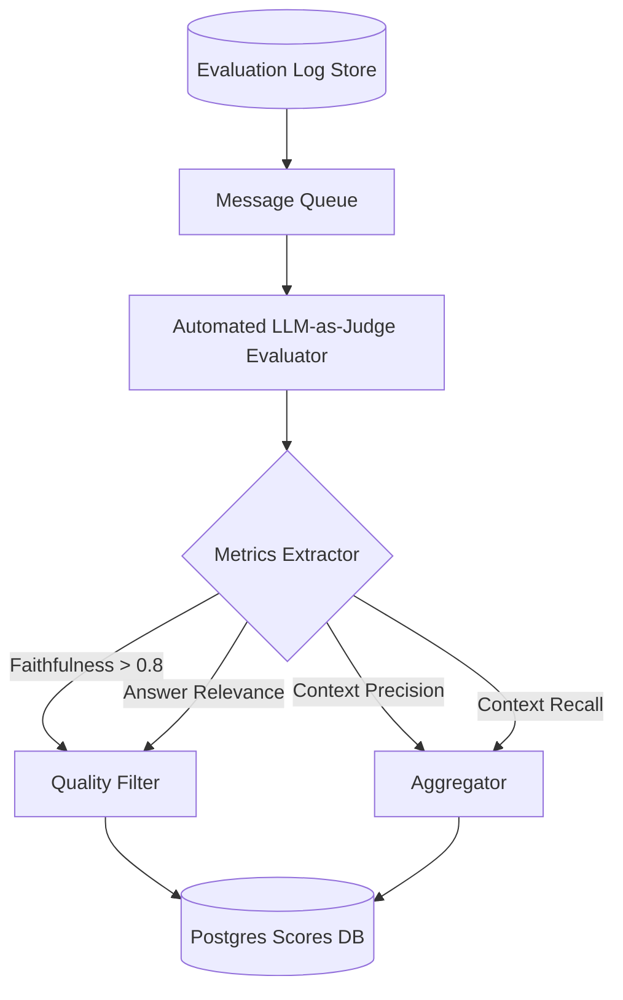

# System Architecture

NeuroFlow is comprised of five primary subsystems designed to handle the complete lifecycle of a retrieval-augmented generation (RAG) system with continuous evaluation and automated fine-tuning capabilities.

## 1. Ingestion Subsystem

**Responsibility:** Accepts raw files of various formats (PDF, DOCX, images, CSV, web URLs), extracts the content using modality-specific parsers, chunks the extracted text, embeds the chunks using an embedding model, and writes the semantic vectors and metadata to the vector store.

**Data Flow:**



## 2. Retrieval Subsystem

**Responsibility:** Receives a user query and executes parallel retrieval strategies. It performs embedding similarity search, keyword search (BM25), and metadata filtering. Results are fused, reranked, and formulated into a context window.

**Data Flow:**



## 3. Generation Subsystem

**Responsibility:** Takes the final context window and user query, formats them into a prompt template, and routes the request to the appropriate LLM based on cost tier, capability, or domain requirements. Responses are streamed token-by-token back to the user and full generation artifacts are logged.

**Data Flow:**



## 4. Evaluation Subsystem

**Responsibility:** Asynchronously evaluates generated responses against their retrieved contexts. It assigns scores for Faithfulness, Answer Relevance, Context Precision, and Context Recall. These scores power rolling aggregates and dashboards.

**Data Flow:**



## 5. Fine-Tuning Subsystem

**Responsibility:** Extracts high-quality examples (based on strict evaluation thresholds) and prepares them for fine-tuning. Jobs are submitted, tracked via MLflow, and successfully fine-tuned models are registered for future intelligent routing.

**Data Flow:**

```mermaid
flowchart TD
    PDB[(Postgres Scores DB)] --> EXTRACT[High Quality Filter (Score > 0.8 & Rating >= 4)]
    EXTRACT --> FORMAT[JSONL Formatter]
    FORMAT --> FT_JOB[Fine-Tuning Job Handler]
    
    FT_JOB <--> MLflow[MLflow Tracker]
    FT_JOB --> REPO[Model Registry]
```
