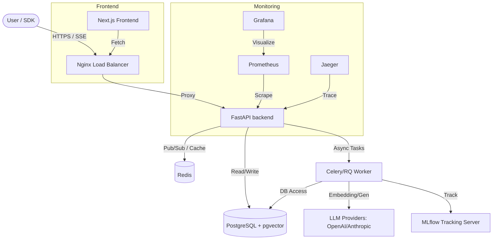

# NeuroFlow Architecture

NeuroFlow is a high-performance, multi-modal RAG platform designed for enterprise-grade document intelligence.

## System Overview

## Subsystems

### 1. API (FastAPI)
The central entry point for all operations. It handles authentication (JWT), request validation, and orchestrates the RAG pipeline. It exposes both synchronous JSON endpoints and asynchronous SSE streams for token generation.

### 2. Retrieval Pipeline
A modular system consisting of:
- **Query Processor**: Expands and cleans user queries.
- **Retriever**: Performs hybrid search (Dense + Sparse) using `pgvector`.
- **Reranker**: Utilizes cross-encoders to refine candidate chunks.
- **Context Assembler**: Formats retrieved snippets for LLM consumption.

### 3. Generation Engine
Connects to external LLM providers (OpenAI, Anthropic). Implements advanced resilience patterns like **Circuit Breakers**, **Backpressure Management**, and **Retry Logic** to ensure high availability.

### 4. Background Workers
Handle long-running tasks such as document ingestion, chunking, embedding generation, and automated evaluation using RAGAS/DeepEval.

### 5. Storage Layer
- **PostgreSQL**: Stores relational metadata and high-dimensional vectors.
- **Redis**: Provides low-latency caching, rate limiting state, and task queueing.

### 6. Observability
- **Prometheus/Grafana**: Infrastructure and application metrics.
- **Jaeger**: Distributed tracing for identifying bottlenecks in the RAG pipeline.
- **MLflow**: Experiment tracking for pipeline optimization and fine-tuning.
